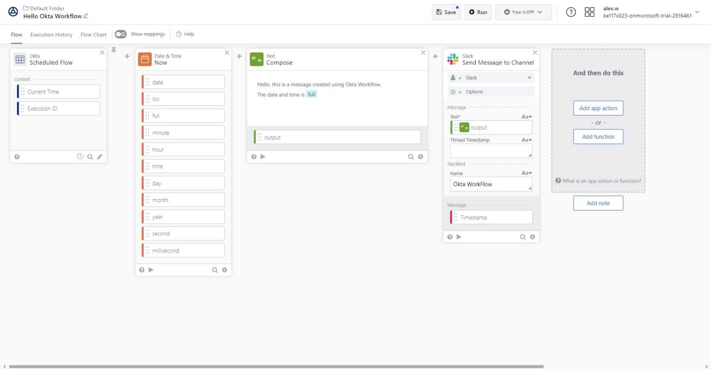

# Slack Message Workflow

This workflow demonstrates how you can use Okta Workflow to send scheduled message to Slack.

### Slack Message Workflow test
Below shows the working example of the Okta Workflow running and sending a message to a Slack channel named **#test**

